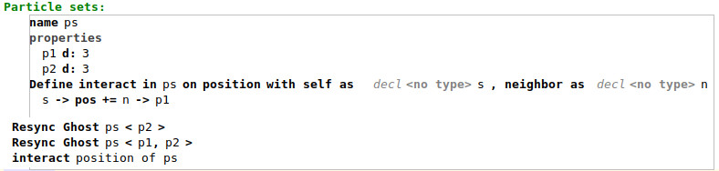
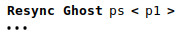
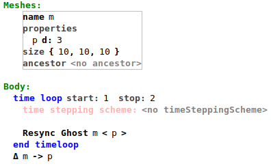

The branch adds the following improvements to OpenPME:
- Model changes
- Dataflow
- Scoping
- Improved code generation
### Model changes
Concepts, which contain a variable reference, which always refer to a container, now contain a `FieldContainerReference` instead. 
Concepts, which contain a list of `Statement`s, e.g. `TypeOfSimulation`, now contain a `StatementList` instead.
Field operations now have a `ContainerPropertyReference` with which the user can specify over which property the field operation is defined (if at all).`check_FieldOperation` ensures that the field operation contains an assignment to the specified property. A field operation can be called by creating a `CallInteract` or `CallEvolve` instance and inserting a reference to the field operation.
### Dataflow
The branch contains mps dataflow specifications for all concepts of the core, expressions, module and statement language.
OpenPME variables/containers, properties and field operations are modeled as dataflow variables. Call statements like `CallInteract` mark the referenced field operation as used and include the dataflow commands for the field operation.   
Typesystem rule `check_DataFlow` makes sure that unused variable assignments, non referenced containers/properties/operations, or unreachable code will be marked as unused.
### Scoping
The branch contains behavior specifications for contributing objects to the completion menu.
All instanceable concepts of the core, expressions, module and statement language contribute scopes for variables/containers (`IVariableDeclaration`), field operations and properties.
When triggering the completion menu, only previously defined objects of the given type are included in the scope, and variables with the same name will be hidden by the last variable.
The completion menu inside a field operation will be filled differently. When calls to the operation exist, the completion menu includes objects which are available from all operation calls. However when there are no calls, all global variables are included in the completion menu. Scope calculations use the `ScopeUtilClass`.
### Code Generation
Major code generation improvements include:
1. Container assignment reduction refactoring
2. Dataflow enduced modifications
3. Loop fusion
4. Decreasing communication

Regarding 1.: Container assignments, or: expressions which contain an assignment and a `BaseAccess` or `ParticlePosititionAccess` as left hand side with a field container as variable reference, need to be reduced to particle or mesh loops. The current implementation uses the class `GeneratorUtilClass` instead of reduction rules to generate the loops.

Regarding 2.: There is a script `apply_dataflow_modifications` which will be run before other code generation rules will be applied, which removes all statements which are marked as unused by the dataflow engine. The script performs a dataflow analysis and removes unreachable code/unused assignments until the analysis doesnt report any more warnings.

Regarding 3.: There is a script `loop_fusion` which will be run after all generation steps of the core language are done. It detects and joins all sequential loops of the same type and container.

Regarding 4.: The generated code uses the OpenFPM framework. Objects of OpenFPM containers, `grid_dist_id` or `vector_dist`, are distributed across processors. Fetching objects from a different processor can be done using method `resync_ghost` (or in OpenPME via `ResyncGhost`, short: resync). OpenFPM is specialized for distance based interactions - called `Ghost`, which can be configured when instantiating the container. Fetching objects copies them into the ghost part, which is a separated area for each processor for each container. There are some concepts of OpenPME which make it possible to access the ghost part. For example, creating a neighbourhood list (iterator) `CreateNeighborList`. A resync statement can be considered as useful, when the ghost objects are accessed afterwards. If theres no such access, the resync is obsolete. Furthermore, since resync statements only synchronize given properties, resync statements containing all subsequent properties are more effective than resyncs with a single property. In order to improve the performance of the generated code, the generator needs to detect and delete obsolete resyncs and group resync properties. Detecting all resyncs starts by making all resyncs, which will be generated, visible to the generator. `weave_InitParticle` and `reduce_WriteParticles` add non formalized resyncs. Script `add_first_map_resync` now adds the `MapVectorDist` and `ResyncGhost` nodes instead of the weave script. `reduce_WriteParticles` hasnt been modified, due to some limitations explained later. There is a script `decrease_communication`, which will be run before the OpenPME model will be transformed into the C++ model. The script detects obsolete resyncs and groups them. It behaves according to those heuristics:
- A resync is always contained in a `StatementList`.
- All statements below the resync but still in the list are checked for structures which are able to access (read) the ghost area.
- "below" will wrap around if the list is contained in a loop.
- Structures considered are:
    - Interpolations
    - Particle loops where each particle iterates over its neighbours
    - Mesh loops where neighboured cells are accessed using `MoveKey`
- if instead of a structure a resync is found, which operates on the same container, the property should be added to the new resync if possible. 

The script is restricted to simple controlflow and doesnt take branching into account. A resync will only be considered as useful in its statement list. A `WriteParticles` node, which generates a resync as well, will usually be used in a branch, therefore the resync wont be formalized.

Some minor changes include:
- refactorings regarding `IParticleContainer` (now `IContainer`): All concepts which need a container reference for the code generation need to implement `IContainer`. For example, an iteration variable needs to know over which container it iterates. Theres an util class `ContainmentUtilClass` for updating the container reference.
- updated dimension retrieval in the reduction rule for `StencilMeshLoop`.
- removing a `CutoffRef` no longer leads to removing the cutoff value.
- if a `VisualizeParticles` file name is specified, it will be used when `WriteParticles` instances will be reduced.
- script `add_resync_in_mloop` now adds one `ResyncGhost` node for each modified container containing all of its modified properties.  
- fixed script `add_celllist` for input models with multiple input roots.
### Evaluation
All solutions are updated to the new model. Most improvements of this branch do not directly contribute to the performance or code quality of the generated code.
Running a dataflow analysis over existing solutions does not result in many warnings. The generated code contains some joined loops. There are pro and contra arguments for and against the usage of `decrease_communication`. A Good aspect is, that its capable of detecting if resyncs are needed for most top level transformations in simple programs (e.g. `InteractCall`). However, since no complex dataflow is analyzed, satisfied properties are wrongly detected, or resyncs removed, which are actually needed. Below is an example for each pov:

| pro-example | contra-example |
|-|-|
|  ->  |   -> timeloop without resync and a laplace transformation below|

The generated code for the three simulations show, that Gray Scott generated unnecessarily many resyncs (before), while the other simulations require their implicit(=added resyncs during generation) and explicit resyncs.
The directory `./evaluation` contains a performance evaluation for the `Use-cases_LK` solutions. The code generation improvements lead to an increase of the performance of the generated code for the Gray Scott simulation by 40% (45 seconds) and a slight performance gain for Vertex-In-Cell by 1% (3 seconds). However for the Lennard Jones simulation, theres a performance decrease by 10% (1 second). Main cause of the performance gain is the reduced communication across processors. Its unclear why the Lennard Jones simulation performs worse than before.
